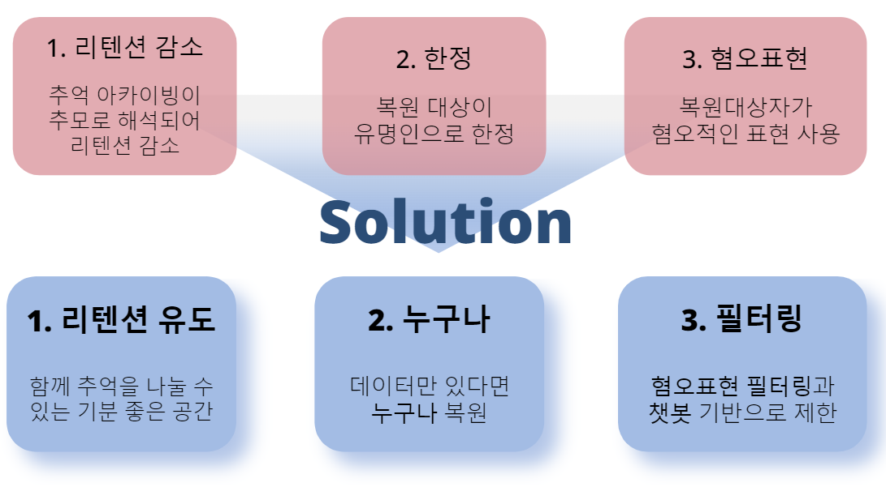

# REmember ME
# [AI 복원 기술을 이용한 추억 공유 플랫폼]
> 음성, 챗팅 복원 기술을 통하여 그리운 사람을 추억하고,  3D 멀티 유저 플랫폼에서 
추억을 쌓는 데이터 리사이클링 프로젝트 

## 기획의도
- 그리워 하는순간을 다시 만날 수 있다면 어떨까? 라는 질문에 시장이 제시한 방법인 다큐, 캠페인, 추모였습니다.

- 시장의 한계를 파악하고 해결하기 위한 프로젝트 REmember ME

 

## 주요 기능

## 주요 사용 기술
- Client(Desktop) 

- Applications API Server 

- AI Server 

## 기술 융합 구조도
